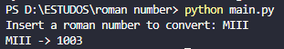

# Roman to integer converter!
> Convert a Roman number (like I, II or even M) to integer (1, 2 or 1000)

The script requires no advanced knowledge or to download libraries, it's made to solve problems with quality and as fast as possible using Python language

### E.g.

## Installation
<ol>
    <li>Install Python (3.x) and a CLI (Pycharm or Visual Studio Code is strongly recommended) on your computer</li> 
    <li>Download the Project and past it where the virtual enviroment is installed</li>
</ol>

## How to use it

<ol>
     
    <h2>Option 1</h2>
     
    <li>Open the CLI you have choosen and, inside the main.py file, click on play button</li>
     
</ol>
<ol>
    <h2>Option 2</h2>
     
    <li>Open your terminal, go right in the path where the project has been downloaded</li> 
    <li>Run the file manually using this command line: 
     <code>python main.py</code>
    </li>
</ol>

## Meta 
 

## Guilherme Bracero Gonzales 

 
LinkedIN - [Guilherme Bracero](https://www.linkedin.com/in/guilherme-bracero/)
 
Instagram - [Bracero](https://instagram.com/guilhermebracero)
 
Email - [guibragon@gmail.com](www.gmail.com) 